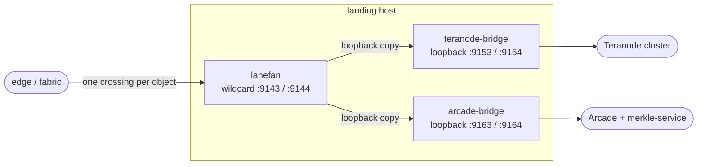

# Deliver once per landing site

A subtree or block object must cross the consumer tunnel (or direct-connect)
into a landing site **exactly once**, no matter how many local consumers use
it. The tunnel is the only scarce resource; anything local to the landing
machine (loopback or LAN) is effectively free. This document is the design for
holding that invariant, including the case where one site runs both an Arcade
stack and a Teranode cluster.

## The single-consumer case (built, today)

An Arcade-only site (or a Teranode-only site) is one consumer slot, one
tunnel, one delivery. The sole bridge binds the slot's tunnel-facing lanes on
the canonical ports and there is no duplication to avoid. This is the common
case and it stays dead simple.

Canonical tunnel-facing delivery-lane ports, shared by both bridges:

| Class | Port |
| --- | --- |
| subtree (BRC-143) | 9143 |
| block (BRC-144) | 9144 |

arcade-bridge previously defaulted these to 9163/9164 so that a second bridge
could bind them on the same host. That was solving the wrong problem: two
bridges binding two lane sets on one host means two consumer slots, and the
fabric then delivers each object across the tunnel **twice**. The canonical
9143/9144 default removes that easy wrong path: two bridges cannot bind the
same port on one host, so the wasteful topology fails fast instead of shipping
quietly.

## The co-located case (design, build when first needed)

When a single site runs both stacks, do **not** provision two consumer slots.
Provision **one** slot whose subtree and block SDA sets enumerate the site's
tunnel exits under `-sda-delivery=failover`. The edge sends the whole object
stream to the first healthy tunnel inner, so each object crosses the DX once
(the delivery pool round-robins or fails over *within* one consumer and never
broadcasts). This is the same posture as the drilled redundant-landing pair:
edge-decided from TCP evidence, with the broker kept out of the runtime
failover path.

Replication happens at the tunnel's far end, where it is free. A small
stateless **lanefan** process on the landing host:

lanefan terminates the one slot's canonical lanes with the public
`teranode-bridge/lanes.Lane` + `shard-common/objfmt.Reader` (verbatim reuse),
deep-copies each whole object once, and hands the immutable copy to a
per-destination bounded-queue async writer per local bridge. Each bridge keeps
its own cache, retrieval plane, announce, and up-tunnel unchanged, and does its
own store-before-announce over its own retrieval plane, so the ordering
contract holds per bridge.

Load-bearing details:

- **Deep-copy is mandatory.** `objfmt.Reader.Next` aliases its internal
  buffer; teranode-bridge already copies for exactly this reason
  (`cmd/teranode-bridge/main.go`). A queue that retained the slice would serve
  corrupt bytes.
- **Per-destination isolation.** One slow or dead downstream must never
  head-of-line-block the tunnel lane or a healthy peer, and a single peer's
  death must never drop the tunnel connection (dropping it would masquerade as
  tunnel failure and spuriously trip host failover). Bounded per-destination
  queues plus `errors.Join` isolation.
- **Loopback ports must differ, not just addresses.** A wildcard `[::]:9143`
  tee also claims `::1:9143` and, under Linux default `bindv6only=0`, the
  IPv4-mapped `127.0.0.1:9143`, so a bridge on the same port on a loopback
  address collides (`EADDRINUSE`). The bridges therefore move to distinct
  loopback **ports** behind the tee: teranode-bridge `[::1]:9153/9154`,
  arcade-bridge `[::1]:9163/9164` (its old numbers, repurposed as the loopback
  convention). Divergent lane ports survive only on loopback, only in this
  opt-in config, never tunnel-facing and never as a default.
- **lanefan is a neutral module.** It is byte plumbing over a public wire
  format: no Kafka, no peer-id, no mine-tag, no reverse path, no broker, no
  mTLS, no entitlement. It is not a mode of the miner binary and not a
  bridge-to-bridge chain, so it brand-couples an Arcade operator to nothing on
  the miner side and puts no binary in another's availability path. It reuses
  `objfmt.Reader` and `lanes.Lane` verbatim; the fan-out writer is new code,
  shaped like the delivery pool but not importing it (that pool lives in a
  private repository).

## Rejected alternatives

- **A control-plane co-delivery group** (the broker delivers once and fans to
  several local overlay endpoints): a point-to-point WireGuard tunnel cannot
  replicate and the delivery pool has no within-tunnel broadcast primitive, so
  a landing-side fan is required regardless. A group buys nothing for
  deliver-once and regresses the drilled, fail-functional, edge-decided
  failover by putting broker membership back in the runtime path.
- **Edge-side frame fan-out** (`egress.MultiSender` / `txegress.MultiSink`):
  fans on the edge *before* the tunnel, which is two crossings; operates on
  framed objects rather than the bare objects that cross the tunnel; and is
  synchronous. Wrong side, wrong layer, wrong concurrency.
- **arcade-bridge sources objects from teranode-bridge** (point merkle-service
  at teranode-bridge's retrieval plane, get arrival events from a tee on the
  miner shim): couples the app tier's delivery to the miner shim at runtime
  (miner down means Arcade delivery stops) and bakes an Arcade-purposed client
  into the public miner binary. A tier-neutral tee gets identical deliver-once
  with none of the coupling.
- **One bridge with both announce sinks** (Teranode Kafka and merkle-service in
  one process): arcade-bridge is not delivery-only; it also runs the facade and
  the up-tunnel submitter, which is Arcade's only transaction-broadcast path
  and cannot move into the miner binary without breaking the open-core split.
